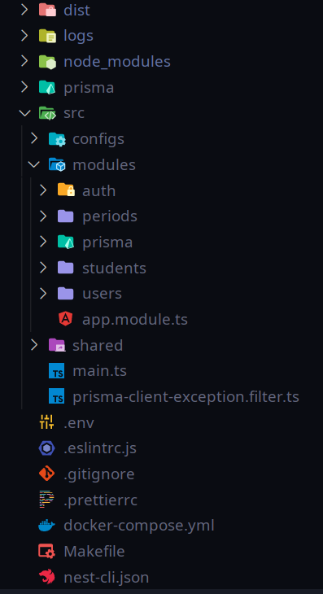

# API de Evasão Escolar

> **API Evasão Escolar** - Backend desenvolvido com NestJs, Prisma e Postgres.  👉 <a href="http://143.198.112.106:3000/api/" target="_blank"> Link do Swagger da API</a> 👉 <a href="https://evasaoifpbcg.com.br" target="_blank">Link do projeto</a>

\* O código fonte da aplicação é mantido em um repositório privado.

## Stack de tecnologias

  
    
  
  
  

-   NestJs
-   Python
-   Typescript
-   Prisma
-   Autenticação Token JWT

## Persistência

-   Postgres com Docker

## Paths

### Authentication

-   /auth/signup -> Cria um usuário (POST)
-   /auth/signin -> Autenticação de usuário (POST)

### Estudante

-   /students -> Lista todos (GET)
-   /students/page?first=10 -> Lista paginados (GET)
-   /students/{id} -> Exibe um estudante pelo id (GET)

### Períodos

-   /periods -> Lista todos os períodos (GET)

## Estrutura de pastas

